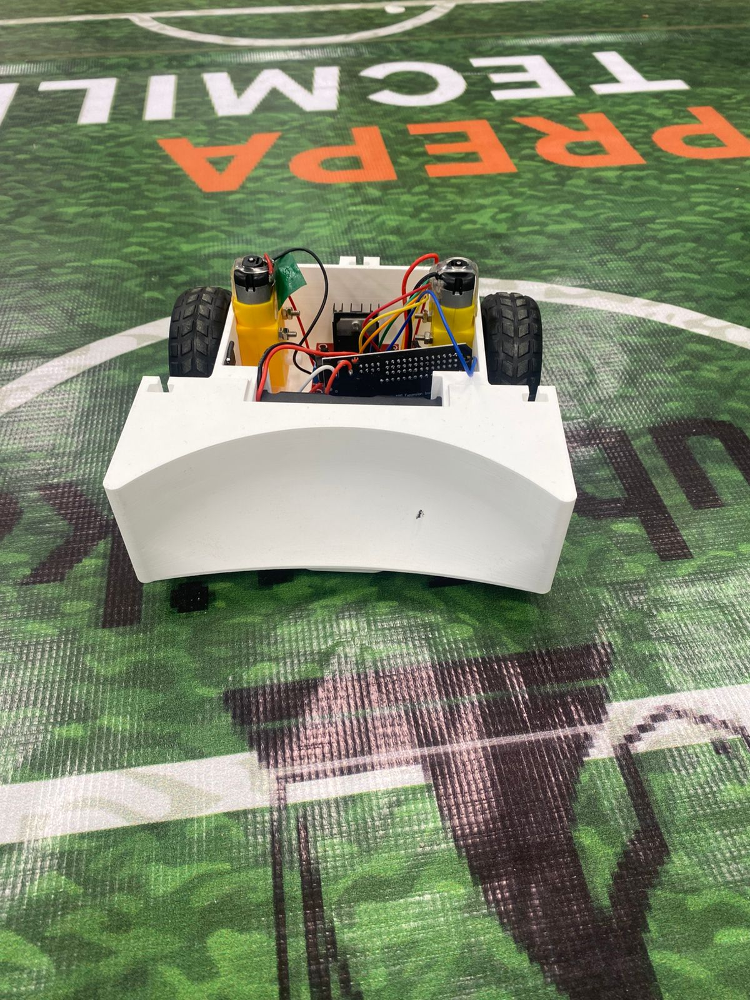
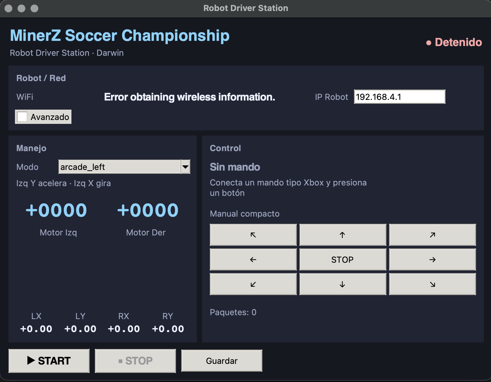

# ⚽ MinerZ Soccer Robot

An open-source ESP32-based educational soccer robot platform designed for robotics clubs, STEM programs, classroom competitions, and hobbyist projects.



---

## Overview

The MinerZ Soccer Robot is a low-cost WiFi-controlled educational robot built around the ESP32 platform.

The project includes:

- ESP32 firmware based on ESP-IDF
- Desktop Driver Station for Windows and macOS
- 3D printable chassis
- Simple modular electronics
- Assembly and wiring documentation
- Optional competition scoring system

The entire platform is designed to be affordable, easy to assemble, and suitable for educational robotics environments.

---

## Features

- ESP32-based control system
- WiFi communication
- Differential drive (tank steering)
- Driver Station support
- Automatic fail-safe protection
- Modular hardware design
- Single-piece 3D printed chassis
- No custom PCB required
- Open-source firmware and documentation

---

## Hardware Overview


Main hardware components:

- ESP32 DevKit (30-pin)
- ESP32 IO Shield
- L298N Motor Driver
- 2 × TT Gear Motors
- 2 × 48 mm Wheels
- 2 × 18650 Li-Ion Cells
- 2S Battery Holder
- Power Switch
- 3D Printed Chassis

Complete hardware details:

- [Bill of Materials](docs/bom.md)

---

## Assembly

The robot can be assembled using basic tools and commonly available components.

Assembly documentation:

- [Assembly Guide](docs/assembly.md)

Assembly process images:

- Motor installation
- Electronics installation
- Final assembly

---

## Wiring


The electronics are intentionally simple and use commonly available modules.

Documentation:

- [Wiring Guide](docs/wiring.md)

---

## Software

### ESP32 Firmware

Firmware written in C using ESP-IDF.

Repository:
[MinerZ Soccer Robot Firmware (ESP32)](https://github.com/MinerZ-Robotics/soccer-robot-firmware-esp32)

### Driver Station

Desktop application used to control the robot over WiFi.

Supported platforms:

- Windows
- macOS



Repository:
[MinerZ Soccer Robot Driver Station](https://github.com/Minerz-Team/soccer-robot-driver-station.git)

Precompiled applications will be available through GitHub Releases.

### Scoring System

Competition scoring software inspired by educational robotics competitions.

Repository:

```text
Coming soon
```

---

## Documentation

Available documentation:

- [Bill of Materials](docs/bom.md)
- [Assembly Guide](docs/assembly.md)
- [Wiring Guide](docs/wiring.md)
- [3D Model Attribution](docs/attribution.md)
- [Changelog](CHANGELOG.md)

---

## 3D Model Attribution

The chassis used in this project is based on:

## Soccer Robot – Battle & Soccer Hybrid Chassis

Author:

Diego Armaker

Original model:

[Thingiverse: Soccer Robot – Battle & Soccer Hybrid Chassis](https://www.thingiverse.com/thing:7239226)

License:

Creative Commons Attribution (CC BY)

See:

- [Attribution Details](docs/attribution.md)

---

## Intended Use

This project is intended for:

- Robotics clubs
- STEM programs
- Educational competitions
- Makerspaces
- Hobby robotics enthusiasts

---

## License

Software components are released under the MIT License.

See:

- [LICENSE](LICENSE)

The modified chassis design remains subject to the attribution requirements of the original CC BY license.

---

## Contributing

Contributions, bug reports, documentation improvements, and feature suggestions are welcome.

If you build a robot using this project, feel free to share your results with the community.

---

## Acknowledgments

Special thanks to:

- Espressif Systems
- The open-source robotics community
- Diego Armaker for the original chassis design
- Educators and students supporting robotics initiatives
