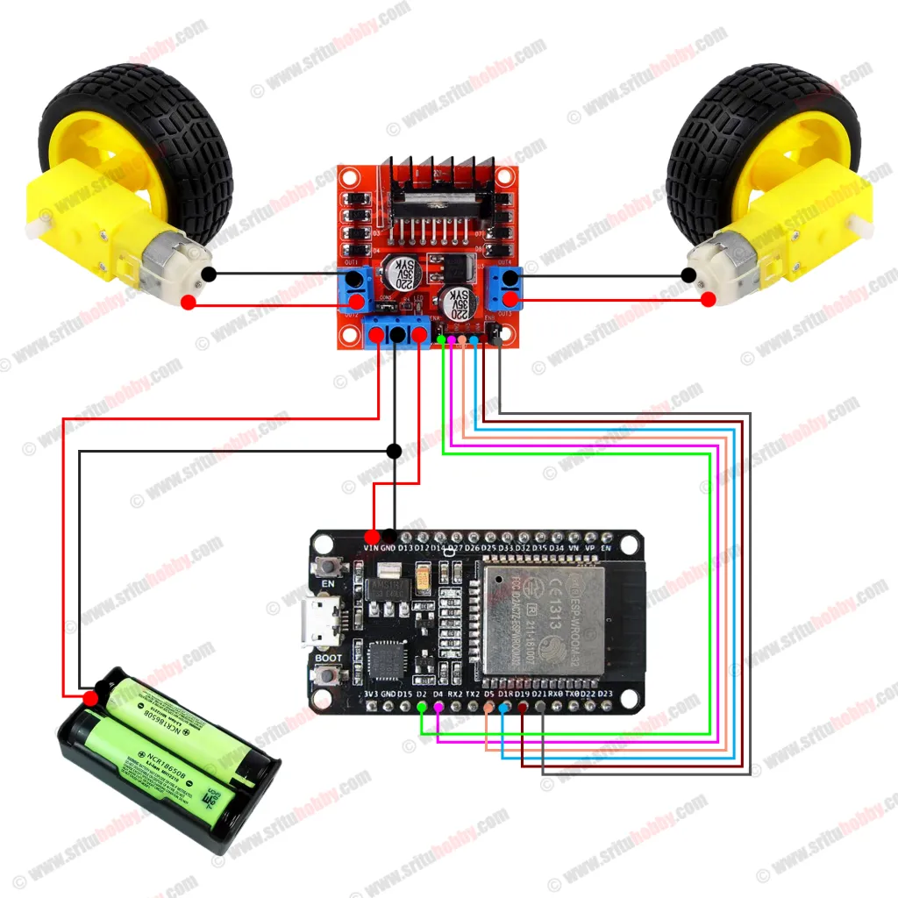

# Assembly Guide

This guide describes the recommended assembly process for the MinerZ Soccer Robot.

---

## Before You Start

Verify that all components listed in the BOM are available.

---

## Step 1 – Install the Motors

Insert the two TT gear motors into the motor mounts integrated into the chassis.

Secure each motor using:

- 2 × M3x35 screws
- 2 × M3 nuts

Total hardware required:

- 4 × M3x35 screws
- 4 × M3 nuts

Verify that both motors are firmly secured.

---

## Step 2 – Connect the Motor Wires

Connect the motor terminals to the L298N motor driver.

At this stage the motor polarity is not critical because motor direction can be adjusted later through wiring or firmware configuration.

Recommended wire colors:

- Red = Motor positive
- Black = Motor negative

---

## Step 3 – Connect Control Wires

Connect jumper wires between the ESP32 IO Shield and the L298N.

Do not connect the ESP32 board yet.

Refer to the wiring guide:

- [Wiring Guide](docs/wiring.md)

---

## Step 4 – Install the Battery Holder

Slide the 2x18650 battery holder into the dedicated slot integrated into the chassis.

No additional hardware should be required.

Verify that the holder cannot move during operation.

---

## Step 5 – Connect Power Wiring

Wire the battery holder, switch, ESP32 shield, and L298N according to the wiring guide.

The positive battery lead must pass through the power switch before reaching the electronics.

---

## Step 6 – Mount Electronics

Mount the following modules:

- ESP32 IO Shield
- L298N Motor Driver

Recommended methods:

- Double-sided foam tape
- Hot glue

Optional:

- Plastic standoffs

---

## Step 7 – Verify Connections

Before inserting the ESP32:

Verify:

- Battery polarity
- L298N power connections
- Shield power connections
- Shared ground connections
- Motor wiring

Carefully inspect all wiring.

Incorrect polarity may permanently damage electronic components.

---

## Step 8 – Install the ESP32

Insert the ESP32 into the IO Shield.

Make sure all pins are properly aligned before applying pressure.

---

## Step 9 – Program the ESP32

Flash the firmware before final deployment.

Programming is significantly easier before the USB port becomes difficult to access.

Firmware repository:
[soccer-robot-firmware-esp32](https://github.com/Minerz-Team/soccer-robot-firmware-esp32.git)

---

## Step 10 – First Power-On Test

Turn the robot on.

Verify:

- ESP32 powers correctly
- WiFi network becomes available
- Motors remain stopped at startup
- No excessive heating is observed

If everything works correctly, proceed with Driver Station testing.

---

## Driver Station Test

Connect the Driver Station to the robot and verify:

- Forward movement
- Reverse movement
- Left turn
- Right turn

If a motor rotates in the wrong direction, swap the motor wires or adjust the firmware motor inversion settings.

---

## Assembly Complete

The robot is now ready for operation.

